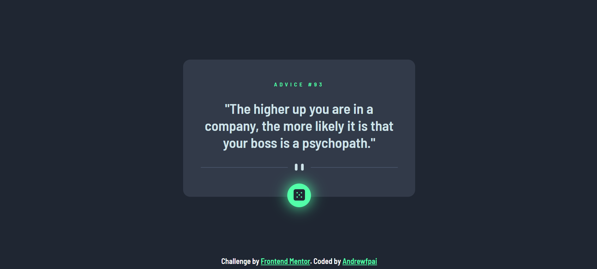

# Frontend Mentor - Advice generator app solution

This is a solution to the [Advice generator app challenge on Frontend Mentor](https://www.frontendmentor.io/challenges/advice-generator-app-QdUG-13db). 

## Table of contents

- [Overview](#overview)
  - [The challenge](#the-challenge)
  - [Screenshot](#screenshot)
  - [Links](#links)
- [My process](#my-process)
  - [Built with](#built-with)
  - [What I learned](#what-i-learned)
- [Author](#author)

## Overview

### The challenge

Users should be able to:
- View the optimal layout for the app depending on their device's screen size.
-See hover states for all interactive elements on the page. 
-Generate a new piece of advice by clicking the dice icon.

### Screenshot

### Links

- Solution URL: [Add solution URL here](https://www.frontendmentor.io/solutions/advicegeneratorappsolution-_5B0_uTbY)
- Live Site URL: [Add live site URL here](https://andrewfpai.github.io/Advice-Generator-App-Solution/)

## My process

### Built with

- Semantic HTML5 markup
- CSS custom properties
- Flexbox
- CSS Grid
- Javascript

### What I learned

I learned how to request and display API data from javascript to HMTL DOM. 

## Author

- Website - [Andrewfpai](https://github.com/Andrewfpai)
- Frontend Mentor - [@andrewfpai](https://www.frontendmentor.io/profile/andrewfpai)

**Note: Delete this note and add/remove/edit lines above based on what links you'd like to share.**